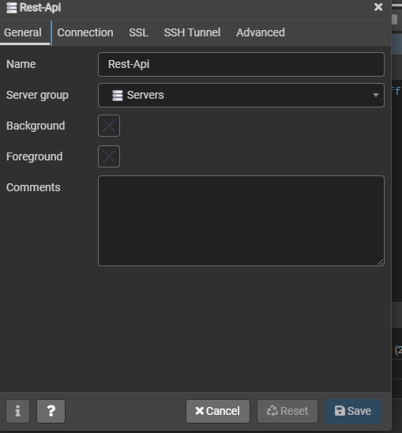
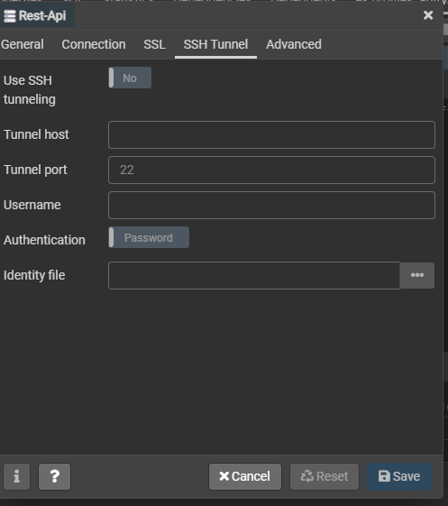

## Table of contents
* [Vagrant Setup](#system-dependencies)
    * [Usage](#usage)
* [Vagrant Issues](#vagrant-issues)
* [Django Environment Issues](#environment-issues)
* [Postgres Issues](#postgres-issues)

# Backend Rest api with django, postgres, vagrant
Repo for Udemy course "Build Backend Rest Api with Django and Python"

### Project Cheat Sheet
- [ ] Add Link to resource Page here
#### Django Resource Links
* [How to override user model in django](https://docs.djangoproject.com/en/2.2/topics/auth/customizing/#auth-custom-user)

* [Linux Commmand Guid](http://www.keyxl.com/aaaf192/83/Linux-Bash-Shell-keyboard-shortcuts.htm)

* [How to use plural name for django class](https://docs.djangoproject.com/en/2.2/ref/models/options/#verbose-name)

- [ ] Fix the vagrant.sh setup file to reflect the venv changes

### System Dependencies

* [VirtualBox with Guest Additions](https://www.virtualbox.org/wiki/Downloads)
* [Vagrant](https://www.vagrantup.com/downloads.html)
* Vagrant plugin Install
    * `vagrant plugin install vagrant-librarian-chef-nochef`
    * `vagrant plugin uninstall vagrant-vbguest`
    * `vagrant plugin install vagrant-vbguest --plugin-version 0.21`
* Windows only: [Git](https://git-scm.com/download/win), for using `vagrant ssh` on Windows easily

> * Make Sure you change the git to run as administrator,
to do this go to git installation and right click on git.exe, bash.exe and under compatibility click on run as administrator
> * Do same for git-bash.exe and git-cmd.exe
### Usage

##### First Run

1. `vagrant up` _to start the VM and run initial provisioning_
3. `vagrant reload` _to restart following the updates installed during provisioning_

##### Subsequent Runs

1. `vagrant up`
2. `vagrant ssh`

##### Destory VM
``vagrant destroy --force``

### Vagrant Issues
#### Default Superuser Password : ``vagrant``
#### Not aware of root password
```shell script
sudo passwd root
```
#### Public or private ssh key issue
* create ssh key using ``ssh-keygen`` inside of your host machine

#### Any PIP related issues 
 
```shell script
sudo apt-get remove --purge python-pip
sudo apt-get remove --purge python3-pip
sudo apt-get autoremove
mkdir ${project_name}
cd ${project_name}
curl  https://bootstrap.pypa.io/pip/3.5/get-pip.py -o get-pip.py
python3 get-pip.py
sudo pip3 install virtualenv
```
> !!! Crate Virtual Environment outside of  /vagrant/ shared folder...
If you go to the home folder of your vagrant user, you can create the virtualenv in there without this problem!
>
>
> Just the venv must be out of this /vagrant/ directory... after that you can go work as usually activating this venv and working with your sorce code in the usual /vagrat/ shared dir...
>
```shell script
cd ~
mkdir virutal_envs
virtualenv virutal_envs/project_name_venv  
```
### Environment Issues
* Environment Setup
```shell script
pip install --user pipenv
pipenv install -r requirements.txt
```
#### Django server not able to listen to host 
* Use curl command in `vagrant ssh` to test the output
```shell script
curl -I http://127.0.0.1:8000/
```
if you get the response in both curl command and manage.py log
that means everything is correct from django side and guest vm side
* Change the runserver command to let any host ip connect
```shell script
python manage.py runserver [::]:8080
```

#### Postgres Issues
> ##### Not able to create a database or anything
```postgresql
/* List all tables in database*/
\l 
/* Find all users database*/
\du 
```
* Login using user with role of superuser, from above \du command 
```shell script
sudo su - postgres
```
* Change permission of user to allow DML or DDL on database
```postgresql
ALTER USER myuser WITH SUPERUSER;
```
* Change the password of user `postgres`
```postgresql
ALTER USER postgres WITH PASSWORD 'vagrant';
```
> ##### Not able to connect to postgres using django settings file.
```shell script
sudo vim /etc/postgresql/9.5/main/postgresql.conf
# Find listen_addresses and change it to
echo "listen_addresses = '*'"
sudo vim /etc/postgresql/9.1/main/pg_hba.conf
# Update host IPv4 to reads
# IPv4 local connections:
host    all             all             127.0.0.1/32            md5
host    all             all             192.168.33.10/24        md5
host    all             all             0.0.0.0/0               md5
# At last 
sudo service postgresql restart
```
> ##### settings for pgadmin4
###### Pgadmin4 General

###### Pgadmin4 Connection

###### Pgadmin4 SSH Tunnel

