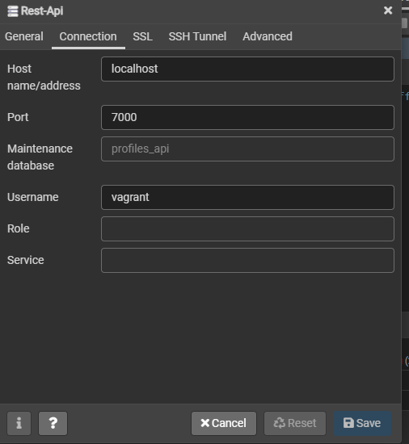

<div id="top"></div>

[![Contributors][contributors-shield]][contributors-url]
[![Forks][forks-shield]][forks-url]
[![Stargazers][stars-shield]][stars-url]
[![Issues][issues-shield]][issues-url]
[![MIT License][license-shield]][license-url]
[![LinkedIn][linkedin-shield]][linkedin-url]

[contributors-shield]: https://img.shields.io/github/contributors/kiran-karandikar/rest-api-django?style=for-the-badge

[contributors-url]: https://github.com/Kiran-Karandikar/rest-api-django/graphs/contributors

[forks-shield]: https://img.shields.io/github/forks/Kiran-Karandikar/rest-api-django?style=for-the-badge

[forks-url]: https://github.com/Kiran-Karandikar/rest-api-django/network

[stars-shield]: https://img.shields.io/github/stars/Kiran-Karandikar/rest-api-django?style=for-the-badge

[stars-url]: https://github.com/Kiran-Karandikar/rest-api-django/stargazers

[issues-shield]: https://img.shields.io/github/issues/Kiran-Karandikar/rest-api-django?style=for-the-badge

[issues-url]: https://github.com/Kiran-Karandikar/rest-api-django/issues

[license-shield]: https://img.shields.io/github/license/Kiran-Karandikar/rest-api-django?style=for-the-badge

[license-url]: https://github.com/Kiran-Karandikar/rest-api-django/blob/master/LICENSE

[linkedin-shield]: https://img.shields.io/badge/-LinkedIn-black.svg?style=for-the-badge&logo=linkedin&colorB=555

[linkedin-url]: https://linkedin.com/in/kiran-karandikar

---------


<!-- PROJECT LOGO -->
<br />
<div align="center">
<h3 align="center">rest-api-django</h3>
  <p align="center">
    Repo for Udemy course "Build Backend Rest Api with Django and Python"    
    <br />    
    <a href="https://kiran-karandikar.github.io/rest-api-django"><strong>Preview</strong></a>
    <br />
    <a href="https://github.com/kiran-karandikar/rest-api-django"><strong>Explore the docs »</strong></a>
    <br />
    <br />
    <a href="https://github.com/kiran-karandikar/rest-api-django">View Demo</a>
    ·
    <a href="https://github.com/kiran-karandikar/rest-api-django/issues">Report Bug</a>
    ·
    <a href="https://github.com/kiran-karandikar/rest-api-django/issues">Request Feature</a>
  </p>
</div>

<!-- BADGES.MD Finish -->
<!-- BADGES.MD Finish -->
# Backend Rest api with django & postgres 
Repo for Udemy course "Build Backend Rest Api with Django and Python"

# Table of contents
> Environment related issues
* [Vagrant Setup](#system-dependencies)
  * [Usage](#usage)
  * [Possible Issues](#vagrant-issues)
* [Django Issues](#environment-issues)
* [Postgres Issues](#postgres-issues)

## Project Cheat Sheet 


## Django Resource Links
* [How to override user model in django](https://docs.djangoproject.com/en/2.2/topics/auth/customizing/#auth-custom-user)

* [Linux Command Guid](http://www.keyxl.com/aaaf192/83/Linux-Bash-Shell-keyboard-shortcuts.htm)

* [How to use plural name for django class](https://docs.djangoproject.com/en/2.2/ref/models/options/#verbose-name)

* [Rest-framework permission](https://www.django-rest-framework.org/api-guide/permissions/)

### System Dependencies

* [VirtualBox with Guest Additions](https://www.virtualbox.org/wiki/Downloads)
* [Vagrant](https://www.vagrantup.com/downloads.html)
* Vagrant plugin Install
    * `vagrant plugin install vagrant-librarian-chef-nochef`
    * `vagrant plugin uninstall vagrant-vbguest`
    * `vagrant plugin install vagrant-vbguest --plugin-version 0.21`
* Windows only:
  * [Git](https://git-scm.com/download/win), for using `vagrant ssh` on Windows easily

> * Make Sure you change the git to run as administrator,
git installation and right click on git.exe, bash.exe under compatibility select  on run as administrator
> * Repeat for git-bash.exe and git-cmd.exe
### Usage
#### First Run

1. `vagrant up` _to start the VM and run initial provisioning_
3. `vagrant reload` _to restart following the updates installed during provisioning_

#### Subsequent Runs
1. `vagrant up`
2. `vagrant ssh`
##### Destroy VM
``vagrant destroy --force``
### *Vagrant Issues*
#### Default Superuser Password : ``vagrant``
#### Forgotten root password
```shell script
sudo passwd root
```
#### _Public or private ssh key issue_
* create ssh key using ``ssh-keygen`` inside of your host machine

#### _Any PIP related issues_
```shell script
sudo apt-get remove --purge python-pip
sudo apt-get remove --purge python3-pip
sudo apt-get autoremove
mkdir ${project_name}
cd ${project_name}
curl  https://bootstrap.pypa.io/pip/3.5/get-pip.py -o get-pip.py
python3 get-pip.py
sudo pip3 install virtualenv
```
> !!! Crate Virtual Environment outside  /vagrant/ shared folder...
If you go to the home folder of your vagrant user, you can create the virtualenv in there without this problem!

> Just the venv must be out of this /vagrant/ directory... after that you can go work as usually activating this venv and working with your source code in the usual /vagrat/ shared dir...
```shell script
cd ~
mkdir virutal_envs
virtualenv virutal_envs/project_name_venv  
```
### Django  Issues
* On first run, install following packages
```shell script
pip install --user pipenv
pipenv install -r requirements.txt
```
#### Django server not able to listen to host 
* Use curl command in `vagrant ssh` to test the output
```shell script
curl -I http://127.0.0.1:8000/
```
if you get the response in both curl command and manage.py log
that means everything is correct from django side and guest vm side
* Change the runserver command to let any host ip connect
```shell script
python manage.py runserver [::]:8080
```
### Postgres Issues
> #### Not able to create a database or similar issue
```postgresql
/* List all tables in database*/
\l 
/* Find all users database*/
\du 
```
* Login using user with role of superuser, from above \du command 
```shell script
sudo su - postgres
```
* Change permission of user to allow DML or DDL on database
```postgresql
ALTER USER myuser WITH SUPERUSER;
```
* Change the password of user `postgres`
```postgresql
ALTER USER postgres WITH PASSWORD 'vagrant';
```
> #### Not able to connect to postgres using django settings file.
```shell script
sudo vim /etc/postgresql/9.5/main/postgresql.conf
# Find listen_addresses and change it to
echo "listen_addresses = '*'"
sudo vim /etc/postgresql/9.1/main/pg_hba.conf
# Update host IPv4 to reads
# IPv4 local connections:
host    all             all             127.0.0.1/32            md5
host    all             all             192.168.33.10/24        md5
host    all             all             0.0.0.0/0               md5
# At last 
sudo service postgresql restart
```
> ### General settings for pgadmin4
##### Pgadmin4 General

##### Pgadmin4 Connection

##### Pgadmin4 SSH Tunnel


### Other projects

Check out the other stuff I've worked upon.

- ___AI/ML/Data Science___

  - **AML-Home-Credit-Default-Risk** : [Predicting how capable each applicant is of repaying a loan \(Kaggle Challenge\).](https://github.com/Kiran-Karandikar/AML-Home-Credit-Default-Risk)

  - **Exercise-performance-analysis** : [Prototype exercise volume prediction using machine learning models.](https://github.com/Kiran-Karandikar/Exercise-performance-analysis)

- ___Web Development___

  - **flask-app-template** : [Simple, reusable, minimalistic, configurable flask app.](https://github.com/Kiran-Karandikar/flask-app-template)

  - **flask-oauth2-wrike-api** : [A sample Flask app to authenticate with Wrike as a third-party OAuth2 provider.](https://github.com/Kiran-Karandikar/flask-oauth2-wrike-api)

> Section `Other projects` is auto-updated using [Github actions](https://github.com/features/actions). 
<!-- CONTACT -->
## Contact

- [Kiran Karandikar: khkarandikar at gmail dot com](mailto:khkarandikar@gmail.com)
